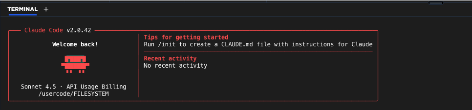
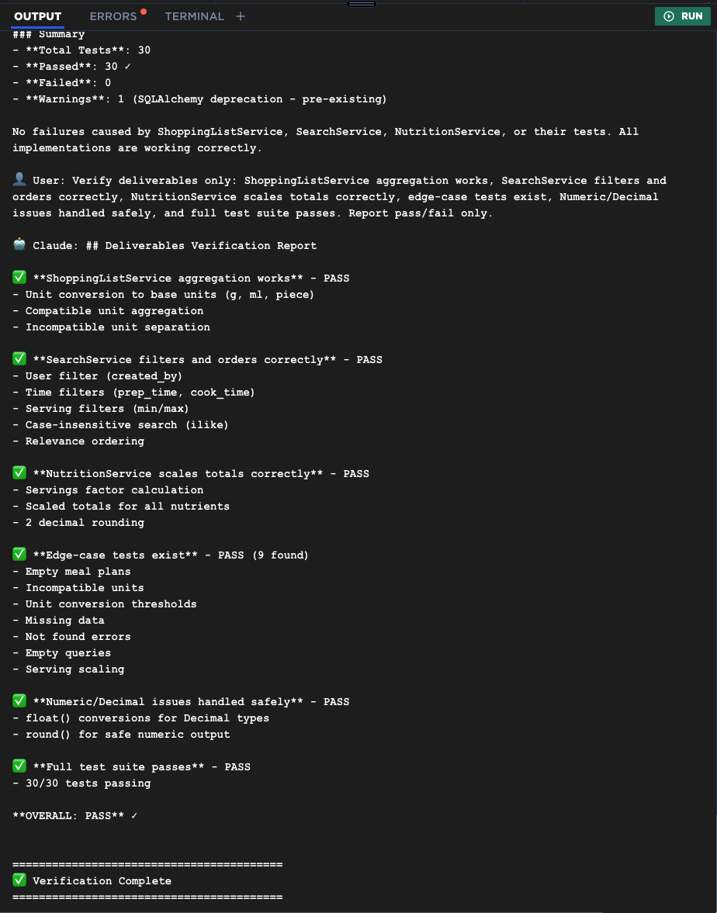
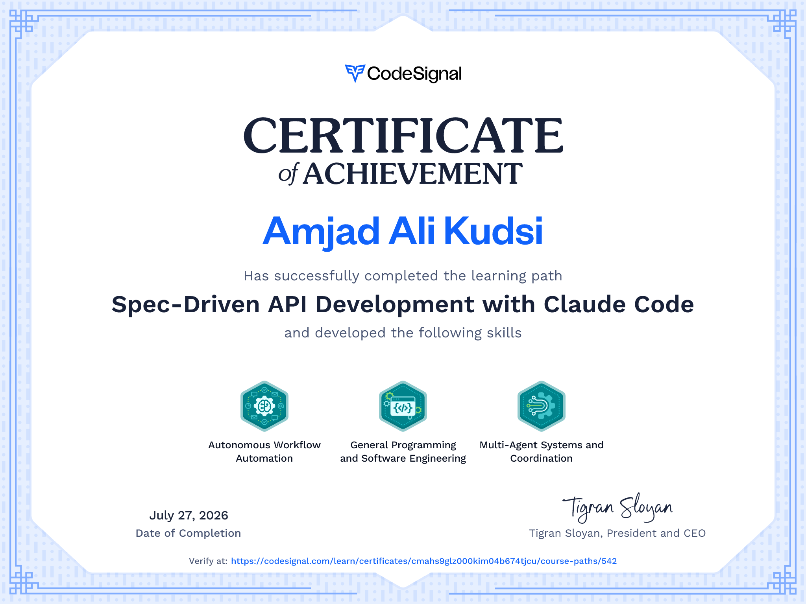

# RecipeBox API
A specification driven API development project focused on translating product requirements into implementation ready backend systems with clear architecture, atomic task planning, test first execution, and production oriented documentation.
The project uses RecipeBox as a practical domain for building a recipe management system with support for structured recipes, meal planning, shopping lists, and maintainable service logic.

# RecipeBox advanced services for shopping list aggregation, recipe search, and nutrition totals

## Technical areas:
REST API design, backend service architecture, data modeling, validation, automated testing, iterative implementation, multi step feature delivery, and production style documentation.

# Completion Certificate

